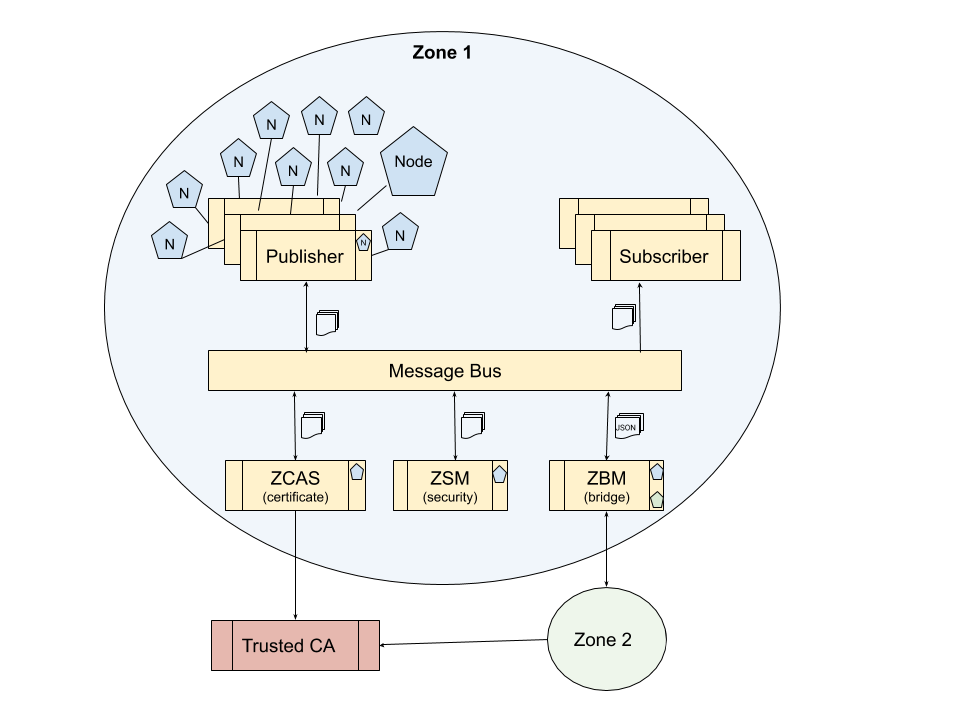

The IotConnect Standard
=======================

The IotConnect standard defines how information is exchanged between IoT publishers and consumers.

[[TOC]]

# Introduction

As connected devices become more and more prevalent, so have the problems surrounding them. These problems fall into multiple categories: 

## Interoperability
   
The use of information produced by various devices is challenging because of the plethoria of different protocol and data formats in use. This is apparent in home automation solutions such as OpenHAB and Home Assistant that each implement hundreds of bindings to talk to different devices and services. Each solution has to reimplement these bindings. This implementation then has to be adjusted to different platforms, eg Linux, Windows and MacOS, which adds even more work.

Without a common standard it is unavoidable that manufacturers of IoT devices choose their own protocols. It is in everyone's interest to provide a standard that enables an open information interchange so that bindings only have to be implemented once. 

This standard defines the messages for information exchange.

## Discovery

Discovery of connected IoT devices often depends on the technology used. There is no standard that describes what and how discovery information is made available to consumers independent of their implementation. 

Application developers often implement solutions specific to their application and the devices that are supported. To facilitate information exchange it must be possible to discover the information that is available independent of the technology used.

This standard defines the process and messaging for discovery of devices and services without the need for a central resource directory. 

Note. The IETF draft "CoRE Resource Directory (draft-ietf-core-resource-directory-20) takes the approach where a centralized service provides a directory of resources. This approach works fine but does not fit within the concept of this standard for several reasons: Mainly it requires and additional direct connection between client and directory which adds an additional protocol with its own encoding. This standard is based on only requiring connections between client and message broker, keeping the attack footprint to a minimum. The protocol is JSON based for all messages. Second, it does not support sharing of information between zones. Last, it does not support the concept of last will and testament when a publisher unexpectedly disconnects from the network. Like most things it is possible to make it work but it is not the best fitting solution.

## Configuration

Configuration of IoT devices is often done through a web portal of some sort from the device itself or a gateway. These web portals are not always as secure as they should be. They often require a login name and password and lack 2 factor authentication. Passwords are easily reused. Backdoors are sometimes left active. Overall security is lacking.
   
Configuration is not always suited for centralized management by application services. For example, to configure all temperature sensors to report in Celcius the user has to login to the device management portal(s), find the sensor and find the configuration for this. This is difficult to automate.

This standard defines the process and messaging for remote configuration of devices and services.

Nodes that can be configured contain a list of configuration records described in the node discovery. The configuration value can be updated with a configure command. This is described further in the configuration section. 

## Security And Privacy
   
Security is a major concern with IoT devices. Problems exist in several areas:

  1. It is difficult to design devices for secure access from the internet. The existance of large botnets from hacked computers and devices show how severe this problem is. Good security is hard and each vendor has to reinvent this wheel. This is not likely to change any time soon.
  
  2. Commercial devices that connect to a service provider share personal information without the user understanding what this information is, and without having control on how it is used. While regulations like Europe's [GDPR](https://en.wikipedia.org/wiki/General_Data_Protection_Regulation) attempt to address this ... somewhat, reports of data misuse and breaches remain all too frequent.

  3. There is no easy and secure way to self-serve information over the internet. It either requires opening a port in the firewall or use a 3rd party service provider, which leads to the previous two problems.

This standard defines the security aspects build into the specification.

# Terminology

| Terminology   | Description |
|:-----------   |:------------|
| Account       | The account used to connect a publisher to an message bus |
| Address       | Address of the node consisting of zone, publisher and node identifier. Optionally it can include the input or output type and instance.|
| Authentication| Method used to identify the publisher and subscriber with the message bus |
| Bridge        | The service that publishes subscribed information into a different zone. |
| Configuration | Configuration of the node configuration|
| Data          | The term 'data' is used for raw data collected before it is published. Once it is published it is considered information.|
| Discovery     | Description of nodes, their inputs and outputs|
| Information   | Anything that is published by a producer. This can be sensor data, images, discovery, etc|
| Message Bus   | A publish and subscribe capable transport for publication of information. Information is published by a node onto a message bus. Consumers subscribe to information they are interested in use the information address. |
| Node          | A node is a device or service that provides information and accepts control input. Information from this node can be published by the node itself or published by a (publisher) service that knows how to access the node. |
| Node Input    | Input to control the node, for example a switch.|
| Node Output   | Node Information is published using outputs. For example, the current temperature.|
| Publisher     | A service that is responsible for publishing node information on the message bus and handle configuration updates and control inputs. Publishers are nodes. Publishers sign their publications to provide source verification.|
| Retainment    | A feature of a message bus that remembers that last published message. Not all message busses support retainment. It is used in publishing the values and discovery messages so new clients receive an instant update of the latest information |
| Subscriber    | Consumer of information that uses node address to subscribe to information from that node.|
| ZBM           | Zone Bridge Manager. Manages bridges to share information with other zones.
| ZCAS          | Zone Certificate Authority Service. This service manages keys and certificates of zone members |
| ZSM           | Zone Security Monitor. Monitors publications in a zone and watches for intrusions.|
| Zone          | An area in which information is shared between members of a zone. |

# Versioning

The standard uses semantic versioning in the form v\{major}.\{minor}.

Future minor version upgrades of this standard must remain backwards compatible. New fields can be added but MUST be optional. Implementations MUST accept and ignore unknown fields and in general follow the [robustness principle](https://engineering.klarna.com/why-you-should-follow-the-robustness-principle-in-your-apis-b77bd9393e4b)

A major version upgrade of this standard is not required to be backwards compatible but **MUST** be able to co-exists on the same bus. Implementations must ignore messages with a higher major version.

Publishers include their version of the standard when publishing their node. See 'discovery' for more information.

# Technology Agnostic

This standard is technology agnostic. It is a standard that describes the information format and exchange for discovery, configuration, inputs and outputs, irrespective of the technology used to implement it. Use of different technologies will actually serve to further improve interoperability with other information sources.

A reference implementation of a publisher is provided for the golang and python languages using the MQTT service bus.

# System Overview

## Zone

A zone defines the area in which information is shared amongst its members. A zone can be a home, a street, a city, or a virtual area like an industrial sensor network or even a game world. Each zone has a globally unique identifier, except for the local zone called '\$local'. Local zones cannot share information with other zones.

A zone has members which are publishers or subscribers (consumers). All members of a zone have access to information published in that zone. The information is not available outside the zone unless intentionally shared. Publication in the zone is limited to members that have the publish permissions. Not surprisingly these are called 'publishers'.

A zone can be closed or open to consumers. An open zone allows any consumer to subscribe to publications in that zone without providing credentials. A closed zone requires consumers to provide valid credentials to connect to the message bus of that zone. Whether a zone is open or closed is determined by the configuration of the message bus for that zone.

A zone has its own topology separate from the underlying TCP/IP network used. It can operate on a local area network or use the internet. The only requirement is that each member can connect to the message bus.

## Message Bus

The use of publish/subscribe message bus has a key role in exchange and security of information in a zone. It not only routes all communications for the zone but also secures publishers and consumers by allowing them to reside behind a firewall, isolated from internet access.

A message bus carries only publications for the zone it is intended for. Multi-zone or multi-tenant message busses can be used but each zone must be fully isolated from other zones. Note that a bridge can publish messages from one zone into another. More on this below.

As the network topology is separate from the zone topology, publishers and subscribers in a zone can be on different networks and behind firewalls. This reduces the attack footprint as none of the publishers or subscribers need to be accessible from the internet. The message bus is the only directly exposed part of the system. It is key to make sure the message bus is properly secured and hardened. For more on securing communication see the security section.

The message bus must be configured to require proper credentials of publishers. Open zones can allow subscribers to omit credentials.

### Message Bus Protocols

This standard is agnostic to the message bus implementation and protocol. The minimum requirement is support for publishing and subscribing using addresses. 

It is highly recommended however that publishers implementation support the MQTT transport protocol. Support for additional transports such as AMQP or HTTP with websockets is optional. 

The reason to choose MQTT as the defacto default is because a common standard is needed for interoperability. MQTT is low overhead, well supported, supports LWT (Last Will & Testament), has QOS, and clients can operate on constrained devices. It is by no means the ideal choice as explained in [this article by Clemens Vasters](https://vasters.com/archive/MQTT-An-Implementers-Perspective.html)

If in future a better protocol becomes the defacto standard, the MQTT protocol will remain supported as a fallback option until this changes in a future version of this standard.

### Guaranteed Delivery (or lack thereof)

The use of a simple message bus, like MQTT, brings with it certain limitations, the main one being the lack of guaranteed delivery. The role of the message bus is to deliver a message to subscribers **that are connected**. While this simplifies the implementation, it pushes the problem of guaranteed delivery to the application. It is effectively a lossy transport between publishers and subscribers.

The standard mitigates this to some extend by supporting a 'history' output that contains recent values. It is possible to catch up to missed messages by checking the history after a reconnect. The penalty is higher bandwidth, and this is only useful in cases of low message rate or high bandwidth capabilities.

Secondly, MQTT supports 'retainment' messages where the last value of a publication is retained. When a consumer connects, it receives the most recent message for all addresses it subscribes to, bringing it instantly up to date (with potentially gaps). Note that not all MQTT implementations support retainment. 

This usage of the message bus will do fine in cases where the goal is to get an up to date recent most value. The loss of a occasional output value in this case is not critical. The use of the history publication can be used to fill in any gaps if needed, but this is only effective for low update frequencies. It well suited for monitoring environmental sensors.

In cases of critical messages such as emergency alerts, some kind of handshake or failover mechanism is strongly adviced. In these cases the transport is merely a step in a longer chain. What matters is that the message is guaranteed to be processed. This requires application level support.

Information exchange handshake over the message bus must be applied at the application level. A service that sends out a critical output message will repeat it until it has received an acknowledgement on its input that it has been processed.

Based on these considerations the use of simple message bus, like MQTT, should be sufficient for most use-cases. 

### Severely Constrained Clients

For severely constrained devices such as micro-controller, a message bus client might simply be too complicated to implement. While the JSON message format is easy to generate, it is not as easy to parse. In these cases it might be better to use an adapter/publisher as the connection point for these devices that translates between to the native protocol and this standard.

### Severely Constraint Bandwidth

In the IoT space, bandwidth can be quite limited. The use of LTE Cat M1, NB-IoT, or LPWAN LTE restrictrs the bandwidth due to cost of the data plan. For example, some plans are limited to 10MB per month. If a sensor reports every minute then a single message is limited to approx 1KB per message including handshake. This almost certainly requires some form of compression or other optimization. Just establishing a TLS connection can take up this much.

The objective of this standard is to support interoperability, not low bandwidth. These are two different concerns that are addressed separately. The use of adapters make it very easy to work with low bandwidth devices using their native protocol.

## Nodes

A zone is populated by nodes that produce or consume information. A node can be a hardware device, a service, or a combination of both.

Nodes can but do not have to be compatible with this standard. For nodes that are not compatible, so-called 'adapter node' provides interoperability between the node native protocol and this standard. 

Nodes that publish information according to this standard are called **publishers**. They publish their own output information or publish information from incompatible nodes.

A node has inputs and/or outputs through which information passes. A node can have many as inputs and outputs that are connected to the node. Inputs and outputs are part of their node and cannot exist without it. 

## Publishers

Publishers are nodes that send and receive messages as per this standard. 

Nodes that are not compatible with this standard require an 'adapter' that publishes on its behalf. In this case there are two nodes, the adapter that is the publisher, and the node whose information is being published. If a gateway is involved then there are three or more nodes. The publisher, the gateway node and each of the nodes that is connected to the gateway.

For example, a ZWave adapter can obtain sensor data from ZWave nodes via a ZWave controller (gateway), and publish information of the ZWave nodes that are connected to this controller. The adapter, the gateway and each zwave device is represented as a node. 

Publishers must use credentials to connect to a zone's message bus before they can publish. To publish securely, a publisher must also have to joined the zone through the Zone Certificate Authority Service (ZCAS). More on that later.

Publishers are responsible for:

1. Publishing output information 
2. Handling requests to update inputs
3. Publish node discovery information
4. Publish input and output discovery information
5. Update node configuration
6. Update security keys and certificates 

These tasks are discussed in more detail in following sections.

### Addressing

Information is published using an address on the message bus. This address consists of the node address to whom the information relates \{zone}/\{publisherID}/\{nodeID}, an input or output type and instance, and a message type. The input/output type and instance are omitted for message that relate to the node.

Address segments can only contain of alphanumeric, hyphen (-), and underscore (\_) characters. Reserved words start with a dollar ($) character. The separator is the '/' character. 

> Address format:
>  **\{zone} / \{publisherId} / \{nodeId} \[ / \{ioType} / \{instance} \] / \{messagetype\}**

Where:
* \{zone} is the zone in which the node information is published
* \{publisherId} is the ID of the service that publishes the node, input and output information
* \{nodeId} is the ID of the node that is being published
* \{ioType} and \{instance} refers to a particular input or output of the node. 
* \{messageType} indicates the content of the message, be it publishing of discovery or values.
For message bus systems that do not support the '/' character as address separator, the separator character of the message bus implementation can be used. However, the message itself must contain the original address using the '/' character as the separator to allow for interoperability between different message bus implementations.

**Reserved Publisher IDs:**

Publishers with special roles have a reserved ID and only a single instance.

* \$zcas - zone certificate authority service for assigning security keys and certificates
* \$bridge - bridge service for bridging messages to other zones
* \$discovery - discovery service for sending discovery info on request

**Reserved Node IDs:**

Nodes with a special role also have a reserved ID. 

* \$publisher - all publishers have this as their own node id. 

**Reserved message types:**

The standard predefines the following message types.

| Node message type | Purpose |
|:--------     |:--------|
| \$batch      | Publication of a batch of events |
| \$configure  | Message to update the node configuration |
| \$create     | Message to create a node. Only usable with publishers that can create/delete nodes |
| \$delete     | Message to delete a node. Only usable with publishers that can create/delete nodes |
| \$event      | Publication of all output values at once using a single event message |
| \$keys       | Command to update the publisher keys and signature (encrypted) |
| \$node       | Publication of a node discovery |
| \$lwt        | Publisher last will and testament if supported |

| Output message type | Purpose |
|:--------     |:--------|
| \$forecast   | publication of a list of projected output values |
| \$history    | publication of a list of historical output values |
| \$latest     | Publication of a single output value including metadata |
| \$output     | Publication of a node output discovery |
| \$value      | Publication of an output sensor value without metadata |

| Input message type | Purpose |
|:--------     |:--------|
| \$input      | Publication of an input discovery |
| \$set        | Set the input value |

### Node Aliases

Node Aliases are intended to support replacing devices while retaining the input and output addresses. When devices are replaced, the node identifier of the replacement can differ from the original. ZWave for example generates a new node ID each time a node is added to the network. This leads to the problem that when replacing a node, all consumers must be updated to use the replacement node ID, which can take quite a bit of effort. 

To address this problem, nodes can be configured with an 'alias' ID. When a node alias is set, all input and output publications use the alias instead of the node ID.

The node alias can be set through the node $configure command. Support for node aliases is optional and implemented in the publisher. If the node configuration does not have an 'alias' configuration option then it is not supported.

## Subscribers

Anyone with permission to connect to the message bus can subscribe to messages published in the zone. Publishers subscribe as well in order to handle configuration updates and input messages.

Consumers such as user interfaces and services that do not publish, are merely subscribers and do not publish as nodes. Open zones can allow anyone to subscribe without credentials. To control configuration and inputs however, consumers must be a publisher with a valid signature.

## Zone Certificate Authority Service - ZCAS

The Zone Certificate Authority Service issues keys and certificates to publishers that have joined the security zone. Publishers use these keys to create a [digital signature](https://en.wikipedia.org/wiki/Digital_signature) for each message they publish so consumers can verify they are sent by the publisher and haven't been tampered with. The publisher identity is signed by the ZCAS when it joined the zone and verifies that the publisher is who it claims to be. For local zones the ZCAS is the highest authority and is protected by the message bus only allowing that service to publish on its address. For public zones the ZCAS itself includes a certificate for its domain in its identity.

For more detail, see the security section

# Discovery

Support for discovery lets consumers find the information they are interested in. The objective is for the node to be sufficiently described so consumers can identify and configure it without further information.

Publishers are responsible for publishing discovery messages for nodes, their inputs and outputs. The discovery data describes the nodes in detail, including their type, attributes and configurations.

Just like publications of the various values, the discovery publications consist of a JSON object with two fields: "message" and "signature". Creation and verification of the base64 encoded signature is described in the 'signing' section.

**Retainment:**

Where supported, discovery messages are published with retainment. When connection to the message bus was lost and is re-established, the discovery messsages are re-published in case the retainment cache was cleared.

When retainment is not available on the message bus, a discovery service can be used for the zone that republishes discovery messages when a request message is received on its input. When subscribers connect to the message bus they send the discovery service a request. The discovery service republishes the discovery messages it received within the last 24 hours, within 1 minute after receiving discovery requests. This is a very simple service that simply republishes what it received. The 1 minute period is intended to prevent a message storm when multiple publishers connect to the bus at the same time.

In all cases discovery messages are re-published periodically to indicate the publisher is still alive and its nodes are available. The default interval is once a day but can be changed through publisher configuration. Without retainment this is best combined with a discovery service. 

## Discover Nodes

Node discovery messages contain a detailed description of the node. It does not contain information on inputs and outputs as these are published separately. This reduces the amount of traffic for simple consumers that only subscribe to certain types of inputs or outputs.

Node discovery address:

  >  **\{zone}/\{publisher}/\{node}/\$node**

If the node is the publisher itself then the reserved '\$publisher' node identifier *MUST* be used.

  >  **\{zone}/\{publisher}/\$publisher/\$node**

Where:
* {zone} is the zone in which the node lives
* {publisher} is the ID of the publisher of the information. The publisher Id is unique within its zone
* {node} is the node that is discovered. This is a device or a service identifier and unique within a publisher. A special ID of “$publisher” is reserved for nodes that are publishes.
* $node command for node discovery

Node discovery message structure:

| Field        | Data Type | Required     | Description
|:-----------  |:--------- |:----------   |:------------
| address      | string    | **required** | The address of the publication
| attr         | map       | **required** | Attributes describing the node. Collection of key-value string pairs that describe the node. The list of predefined attribute keys are part of the standard. See appendix B: Predefined Node Attributes. |
| config       | List of **Configuration Records** | optional | Node configuration, if any exist. Set of configuration objects that describe the configuration options. These can be modified with a ‘$configure’ message.|
| nodeId       | string    | **required** | ID of this node
| timestamp    | string    | **required** | Time the record is created |
| identity     | Identity  | publishers   | Publisher identity used to identify the publisher in secure zones. Includes public keys for verifying and encryption. Only included with publishers |
| identitySignature  | string    | optional     | Base64 encoded signature of the identity signed by the ZCAS. Empty for publishers that have not joined the secure zone.

**Configuration Record**

The configuration record is used in both node configuration and input/output configuration. Each configuration attribute is described in a record as follows:

| Field    | Data Type | Required  | Description |
|:-------- |:--------- |:--------- |:----------- |
| name     | string    | **required** | Name of the configuration. This has to be unique within the list of configuration records. See also Appendix C: Predefined Configuration Names |
| datatype | enum      | optional| Type of value. Used to determine the editor to use for the value. One of: bool, enum, float, int, string. Default is ‘string’ |
| default  | string    | optional| Default value for this configuration in string format |
| description| string  | optional | Description of the configuration for human use |
| enum     | \[strings] | optional* | List of valid enum values as strings. Required when datatype is enum |
| max      | float     | optional | Optional maximum value for numeric data |
| min      | float     | optional | Optional minimum value for numeric data | 
| secret   | bool      | optional | Optional flag that the configuration value is secret and will be left empty. When a secret configuration is set in \$configure, the value is encrypted with the publisher node public key. |
| value    | string    | **required**| The current configuration value in string format. If empty, the default value is used if provided. |

**Identity Record**

The identity record is included with nodes that are publishers and is intended to verify the identity of the publisher. It is signed by the ZCAS when the publisher joins a secure zone and renewed periodically. Consumers must verify the signature using the ZCAS public key when the publisher node is updated.

| Field           | type     | required     | Description |
|:--------------- |:-------- | :----------  |:----------- |
| expires         | string   | **required** | ISO8601 Date this identity expires |
| location        | string   | optional     | Location of the publisher, city, province/state, country |
| organization    | string   | optional     | Organization the publisher belongs to |
| cryptoPublicKey | string   | **required** | Base64 encoded public key for encrypting messages to the publisher | 
| SigningPublicKey| string   | **required** | Base64 encoded public key for verifying publisher signatures |
| publisher       | string   | **required** | The publisher node ID |
| timestamp       | string   | **required** | Time the identity was re-signed |
| url             | string   | optional     | URL of the publisher information page |
| zone            | string   | **required** | The zone ID in which the publisher lives |

Example payload for node discovery

~~~json
zone-2/openzwave/5/\$node:
{
  "message": {
    "address": "zone-2/openzwave/5/$node",
   
    "attr": {
      "make": "AeoTec",
      "type": "multisensor"
    },
    "config": {
      "name": {
        "datatype": "string",
        "description": "Friendly name",
        "value": "barn multisensor"
      }, 
    },
    "timestamp": "2020-01-20T23:33:44.999PST",
  },
  "signature": "..."
}
~~~

## Discover Inputs and Outputs

Inputs and outputs discovery are published separately from the node. The discovery of each output and each input is published separately. This facilitates asynchroneous discovery of inputs and outputs and allows control over which outputs are shared with other zones. 

Address of input discovery:

> **\{zone}/\{publisherId}/\{nodeId}/\{inputType}/\{instance}/\$input/**

Address of output discovery:

> **\{zone}/\{publisherId}/\{nodeId}/\{outputType}/\{instance}/\$output**

| Address segment | Description |
| :-------------- | :---------- |
| {zone}          | The zone in which the node lives |
| {publisherId}   | The service that is publishing the information |
| {nodeId}        | ID or alias of the node that owns the input or output |
| {inputType}     | Type identifier of the input. For a list of predefined types see Appendix D |
| {outputType}    | Type identifier of the output. For a list of predefined types see Appendix D |
| {instance}      | The instance of the input or output on the node. If only a single instance exists the standard is to use 0 unless a name is used to provide more meaning|
| \$input         | Message type for input discovery, or |
| \$output        | Message type for output discovery |

For example, the discovery of a temperature sensor on node '5', published by a service named 'openzwave', is published on address:

  > **$local/openzwave/5/temperature/0/\$output**

The message structure:

| Field       | Data Type | Required     | Description |
|:----------- |:--------- |:---------    |:----------- |
| address     | string    | **required** | Address of the publication |
| config      | List of **Configuration Records**|optional|List of Configuration Records that describe in/output configuration. Only used when an input or output has their own configuration |
| datatype    | string    | optional     | Value datatype. See appending for datatypes, default is string
| description | string    | optional     | Description of the in/output for humans |
| enumValues  | list      | optional*    | List of possible values. Required when datatype is enum |
| instance    | string    | **required** | Output instance for for multi-I/O nodes |
| max         | number    | optional     | Maximum possible in/output value |
| min         | number    | optional     | Minimum possible in/output value |
| timestamp   | string    | **required** | Time the record is created |
| outputType  | string    | **required** | Type of output. See the output type list for standardized type names |
| unit        | string    | optional     | The unit of the data type |

Example payload for output discovery:

~~~json
$local/openzwave/5/\$output/temperature/0:
{
  "message": {
    "address": "$local/openzwave/5/temperature/0/$output",
    "datatype": "float",
    "instance": "0",
    "timestamp": "2020-01-20T23:33:44.999PST",
    "outputType": "temperature",
    "unit": "C",
  },
  "signature": "...",
}
~~~   

# Publishing Output Values

Publishers monitor the outputs of their nodes and publish updates to node output values when there is a change. Output values are published using various commands depending on the content, as described in the following paragraphs.

>The general output value address is:
>  **\{zone}/\{publisherId}/\{nodeId}/\{type}/\{instance}/\{$messageType}**

| Address segment | Description|
|:--------------- |:-----------|
| {zone}          | The zone in which publishing takes place |
| {publisher}     | The service that is publishing the information. The publisher Id is unique within its zone |
| {node}          | The node that owns the input or output. This is the node identifier |
| {type}          | The type of output, for example "temperature". This standard includes a list of output types |
| {instance}      | The instance of the type on the node |
| {$messageType}  | Type of output value publication as described in the following paragraphs: $value, $latest, ...|

With exception of the \$value command, all publications contain a payload consisting of a JSON object with a message and signature in the form:

~~~json
{
  "message": {},
  "signature": "..."
}
~~~

The signature is the hash of the message content, encrypted using the private key of the publisher. The result is encoded in a base64 string. The received can verify the authenticity of the message by decrypting the signature using the publisher's public key, and comparing the resulting hash with the message hash. See more information in the 'signing' section. 

## \$value: Publish Single 'no frills' Output Value

The payload used with the '\$value' message type is the pure information as text, without any signature or other metadata. It is the only message without the json message and signature as described above.

The \$value publication is the fallback that every publisher *MUST* publish. It is intended for interoperability with highly constrained devices or 3rd party software that do not support JSON parsing. The payload is therefore the straight value.

Address:  **\{zone}/\{publisherId}/\{nodeId}/\{type}/\{instance}/\$value**

Payload: Output value, converted to string. There is no message JSON and no signature.

Example:
~~~
zone-1/openzwave/6/temperature/0/\$value: "20.6"
~~~

## \$latest: Publish Latest Output With Metadata

The \$latest publication contains the latest known value of the output including metadata such as the unit and timestamp. The value is represented as a string. Binary data is converted to base64. 

This is the recommended publication publishing updates to single value sensors. See also the \$event publication for multiple values that are related. 

Address:  **\{zone}/\{publisherId}/\{nodeId}/\{type}/\{instance}/\$latest**

The message structure is as follows:

| Field        | Data Type | Required     | Description |
|:-------------|:----------|:------------ |:----------- |
| address      | string    | **required** | Address of the publication |
| timestamp    | string    | **required** | timestamp of the value ISO8601 "YYYY-MM-DDTHH:MM:SS.sssTZ" |
| unit         | string    | optional     | unit of value type, if applicable |
| value        | string    | **required** | value in string format |

Example of a publication on zone-1/openzwave/6/\$latest/temperature/0:

~~~json
{
  "message": {
    "address": "zone-1/openzwave/6/$latest/temperature/0",
    "timestamp": "2020-01-16T15:00:01.000PST",
    "unit": "C",
    "value": "20.6",
  },
  "signature": "..."
}
~~~

## \$forecast: Publish Forecasted Output Values

The payload for the '\$forecast' command contains an ordered list of the projected future values along with address information and signature. The forecast is published each time a value changes. 

Address:  **\{zone}/\{publisherId}/\{nodeId}/\{type}/\{instance}/\$forecast**

The message structure:

| Field        | Data Type | Required     | Description |
|:----------   |:--------  |:-----------  |:------------ |
| address      | string    | **required** | Address of the publication |
| duration     | integer   | optional     | Nr of seconds of forecast
| forecast     | list      | **required** | eg: \[\{"timestamp": "YYYY-MM-DDTHH:MM:SS.sssTZ","value": string}, ...] |
| | timestamp  | string    | ISO8601 "YYYY-MM-DDTHH:MM:SS.sssTZ" |
| | value      | string    | Value in string format using the node's unit |
| timestamp    | string    | **required** | timestamp the forecast was created |
| unit         | string    | optional     | unit of value type |

For example:

~~~json
zone-1/openzwave/6/$forecast/temperature/0:
{
  "message": {
    "address" : "zone-1/openzwave/6/temperature/0/$forecast",
    "duration": "86400",
    "forecast" : [
      {"timestamp": "2020-01-16T16:00:01.000PST", "value" : "20.4" },
      {"timestamp": "2020-01-16T17:00:01.000PST", "value" : "20.6" },
      ...
    ],
    "timestamp": "2020-01-16T15:00:01.000PST",
    "unit": "C",
  },
  "signature": "...",
}
~~~

## \$history: Publish History of Recent Output Values

The payload for the '\$history' command contains an ordered list of the recent values. The history is published each time a value changes. The history publication is optional and intended for users that like to view a 24 hour trend. It can also be used to check for missing values in case transport reliability is untrusted. The content is not required to persist between publisher restarts.

Address:  **\{zone}/\{publisher}/\{node}/\{type}/\{instance}/\$history**

The message structure:

| Field        | Data Type | Required     | Description |
|:----------   |:--------  |:-----------  |:------------ |
| address      | string    | **required** | Address of the publication |
| duration     | integer   | optional     | Nr of seconds of history. Default is 24 hours (24*3600 seconds)
| history      | list      | **required** | eg: \[\{"timestamp": "YYYY-MM-DDTHH:MM:SS.sssTZ","value": string}, ...] |
|| timestamp   | string    | ISO8601 "YYYY-MM-DDTHH:MM:SS.sssTZ" |
|| value       | string    | Value in string format using the node's unit |
| timestamp    | string    | **required** | timestamp of the message |
| unit         | string    | optional     | unit of value type |

For example:

~~~json
zone-1/openzwave/6/temperature/0/$history:
{
  "message": {
    "address" : "zone-1/openzwave/6/temperature/0/$history",
    "duration": "86400",
    "history" : [
      {"timestamp": "2020-01-16T15:20:01.000PST", "value" : "20.4" },
      {"timestamp": "2020-01-16T15:00:01.000PST", "value" : "20.6" },
      ...
    ],
    "unit": "C",
  },
  "signature": "...",
}
~~~

## \$event: Publish Event With Multiple Output Values

The optional \$event publication indicates the publisher provides multiple output values with the same timestamp as a single event. This can be used in lieu of publishing output values separately and thus reduce bandwidth. It can also be useful to publish multiple values that are highly correlated. 

The event value can include one, multiple or all node outputs. 

Address:  **\{zone}/\{publisher}/\{node}/\$event**

The message structure:

| Field        | Data Type | Required     | Description |
|:----------   |:--------  |:-----------  |:------------ |
| address      | string    | **required** | Address of the publication |
| event        | map       | **required** | Map with one or more {output type/instance : value} 
| timestamp    | string    | **required** | timestamp of the event in ISO8601 format |

For Example:

~~~json
zone-1/vehicle-1/\$publisher/\$event:
{
  "message" : {
    "address" : "zone-1/vehicle-1/$publisher/$event",
    "event" : [
      {"speed/0": "30.2" },
      {"heading/0": "165" },
      {"rpm/0": "2000" },
      {"odometer/ecu": "2514333222" },
      ...
    ],
    "timestamp": "2020-01-16T15:00:01.000PST",
  },
  "signature": "...",
}
~~~   

## \$batch: Publish Batch With Multiple Events

The optional \$batch publication indicates the publisher provides multiple events. This is intended to reduce bandwidth in case for high frequency sampling of multiple values. Consumers must process the events in the provided order, as if they were sent one at a time.

Address:  **\{zone}/\{publisherId}/\{nodeId}/\$batch**

The message structure:

| Field        | Data Type | Required     | Description |
|:----------   |:--------  |:-----------  |:------------ |
| address      | string    | **required** | Address of the publication |
| batch        | list      | **required** | Time ordered list of events with their timestamp, oldest first and newest last.|
| | timestamp   | string    | timestamp of the event in ISO8601 format "YYYY-MM-DDTHH:MM:SS.sssTZ" |
| | event       | map       | Map with {output type/instance : value} |
| timestamp    | string    | **required** | ISO8601 timestamp this message was created |

## \$lwt: Publish Last Will & Testament (MQTT)

This message only applies when using a message bus that supports LWT (last will & testament) .

The LWT option lets the message bus publish a message when the publisher connection is lost unexpectedly. A message with status "connected" and "disconnected" is sent by the publisher when connecting or gracefully disconnecting. The status "lost" is set through last will & testament feature and send by the message bus if the publisher unexpectedly disconnects. 

Address:  **\{zone}/\{publisherId}/\$publisher/\$lwt**

Message structure:
The message structure:

| Field        | Data Type | Required     | Description |
|:----------   |:--------  |:-----------  |:------------ |
| address      | string    | **required** | Address of the publication |
| status       | string    | **required** | LWT status: "connected", "disconnected", "lost"

# Input Commands

Input commands are send by other publishers to provide input to a node. The messages of all input commands contain the address of the sender. 

In secured zones, only publishers that have joined the secure zone and provide a valid signature are allowed to send input commands. Receivers can verify the message signature with the sender's public key, provided with its discovery message. If this verification fails then the input command must be ignored.

Additional restrictions can be imposed by limiting updates to specific publishers.

## \$set: Set Input Value
Publishers subscribe to receive commands to update the inputs of the node they manage.

Address:  **\{zone}/\{publisher}/\{node}/\{type}/\{instance}/\$set**

The message structure:

| Field        | Data Type | Required      | Description
|:------------ |:--------- |:----------    |:-----------
| address      | string    | **required** | Address of the publication |
| timestamp    | string    | **required**  | Time this request was created, in ISO8601 format, eg: YYYY-MM-DDTHH:MM:SS.sssTZ. The timezone is the local timezone where the value was published. If a request was received with a newer timestamp, up to the current time, then this request is ignored. |
| sender       | string    | **required** | Address of the sender node of the message (zone/publisherId/nodeId) |
| value        | string    | **required** | The control input value to set |

For Example:

~~~json
zone-1/openzwave/6/switch/0/\$set:
{
  "message": {
    "address" : "zone-1/openzwave/6/switch/0/\$set",
    "sender": "zone-1/mrbob/$publisher",
    "timestamp": "2020-01-02T22:03:03.000PST",
    "value": "true",
  },
  "signature": "...",
}
~~~

## \$create: Create Node

Publishers where users can create and delete nodes subscribe to this command. For example to add a new ip camera, the ip camera publisher can be told to create a new node for a new camera where nodeId is the camera ID.

Address:  **\{zone}/\{publisherId}/\{nodeId\}/\$create**

The message structure:

| Field        | Data Type | Required      | Description
|:------------ |:--------- |:----------    |:-----------
| address      | string    | **required**  | Address of the publication |
| config       | map       | **required**  | key-value pairs for configuration of the node. This is the same content as the config field in the $configure command
| sender       | string    | **required** | Address of the sender node of the message (zone/publisherId/nodeId) |
| timestamp    | string    | **required**  | Time this request was created, in ISO8601 format, eg: YYYY-MM-DDTHH:MM:SS.sssTZ. The timezone is the local timezone where the value was published. If a request was received with a newer timestamp, up to the current time, then this request is ignored. | nodeID       | string    | **required** | ID of the node to create. Must be unique within the publisher. For example the camera name |

For Example, To create a new camera node with the ipcam publisher:

~~~json
zone-1/ipcam/$publisher/\$create:
{
  "message": {
    "address" : "zone-1/ipcam/Kelowna-Bennett/$create",
    "config" : { 
      "url":"https://images.drivebc.ca/bchighwaycam/pub/cameras/149.jpg",
      "name": "Kelowna Bennett bridge",
      },
    "sender": "zone-1/mrbob/$publisher",
    "timestamp": "2020-01-02T22:03:03.000PST",
    "nodeID": "Bennet-Bridge",
  },
  "signature": "...",
}
~~~

## \$delete: Delete Node

Publishers that support creation and deletion of nodes, subscribe to this command. For example to delete an ip camera, the ip camera publisher can be told to delete the camera node.

Address:  **\{zone}/\{publisherId}/{nodeId}/\$delete**

The message structure:

| Field        | Data Type | Required      | Description
|:------------ |:--------- |:----------    |:-----------
| address      | string    | **required**  | Address of the publication |
| sender       | string    | **required**  | Address of the publisher node of the message |
| timestamp    | string    | **required**  | Time this request was created, in ISO8601 format, eg: YYYY-MM-DDTHH:MM:SS.sssTZ. The timezone is the local timezone where the value was published. If a request was received with a newer timestamp, up to the current time, then this request is ignored. | 

For Example, To delete a previously created camera node:

~~~json
zone-1/ipcam/\Kelowna-Bennett/\$delete:
{
  "message": {
    "address" : "zone-1/ipcam/Kelowna-Bennet/$delete",
    "sender": "zone-1/mrbob/$publisher",
    "timestamp": "2020-01-02T22:03:03.000PST",
  },
  "signature": "...",
}
~~~

# Configuring A Node  

Support for remote configuration lets administrators manage devices and services over the message bus. 

Publishers of node discovery information include the available configurations for the published nodes. These publishers handle the configuration update messages for the nodes they publish. 

In secured zones, only publishers that have joined the secure zone and provide a valid signature are allowed to update node configuration. Receivers can verify the message signature with the sender's public key, provided with its discovery message. If this verification fails then the input command must be ignored. Additional restrictions can be imposed by limiting updates to specific publishers.

Address:  **\{zone}/{publisher}/{node}/\$configure**

Configuration Message structure:

| Field        | type     | required     | Description
|:------------ |:-------- |:------------ |:----------
| address      | string   | **required** | Address of the publication |
| config       | map      | **required** | key-value pairs for configuration to update { key: value, …}. **Only fields that require change should be included**. Existing fields remain unchanged.
| sender       | string   | **required** | Address of the sender node of the message |
| timestamp    | string   | **required** | Time this request was created, in ISO8601 format

Example payload for node configuration:

~~~json
zone1/openzwave/5/\$configure:
{
  "message": {
    "address": "zone1/openzwave/5/$configure",
    "config": {
      "name": "My new name"
    },
    "sender": "zone1/mrbob/$publisher",
    "timestamp": "2020-01-20T23:33:44.999PST",
  },
  "signature": "...",
}
~~~   

# Security

Bus communication should be considered unsafe and must be protected against man-in-the-middle and spoofing attacks. All publications must be considered untrusted unless it is correctly signed by its publisher and the publisher identity is verified by the ZCAS.

To verify a publisher identitiy it must have joined a secure zone as described below. 

## Joining A Secure Zone

A publisher joins the zone in order to receive keys and identity signature that can be verified by subscribers. Keys and signature are issued by the Zone Certificate Authority Service - ZCAS. 

The steps to join the zone:
1. Generate a public/private key pair on first use.
2. Publish the publiser node discovery message containing the identitiy and public key as described in the node discovery section
3. Wait for the administator to mark the publisher as trusted. This requires approval by the administrator.
4. Accept regular updates of keys, identity and signatures from the ZCAS and re-publish changes to the node identity signature or public signing key.

**Generating a temporary signing keyset**

Initially the publisher must create their own private and public keyset. The public key is included in the publisher's identity node. 

**Administrator Marks The Publisher As Trusted**

The **ZCAS** is the Zone Certificate Authority Service. Its purpose is to issue keys and identity signatures to publishers that have joined the zone.

The ZCAS needs to be told that the publisher with public key X is indeed the publisher with the ID it claims to have. Optionally additional identity can be required such as location, contact email, phone, administrator name and address. 

The method to establish trust can vary based on the situation. The following method is used in the ZCAS reference implementation. 

1. On installation of a new publisher, the administrator notes the publisher ID and the public key generated by that publisher. The publisher publishes its discovery using the temporary key.

2. Next, the administrator logs in to the ZCAS service. The service shows a list of untrusted publishers. The administrator verifies if the publisher and the public key match. If there is a match, the administrator informs the ZCAS that the publisher can be trusted. 

**ZCAS issues new keys and signs identity**

When a publisher status changes from untrusted to trusted, the ZCAS starts the cycle of key and identity signature renewal as described below.
   

## Renewing Publisher Keys And Identity Signature - ZCAS

A publisher that has joined the zone is issued new keys and identity signature by the ZCAS automatically when its identity has less than half its life left. This is triggered when a publisher publishes its own node information using a valid signature. Once a publisher uses the newly issued keys and signature, ZCAS removes the old key from its records. The publisher must persists the newly issued key and signature before publishing using the new keys. The ZCAS stores the public key and expiry of publisher identity so it knows to issue a new set of keys and identity signature. The lifetime of a signed identity is relatively short. The default is 30 days. After half this time the identity is renewed by the ZCAS service. If no trusted public key is on record for the publisher, the publisher is marked as untrusted and the identity key is stored for review by administrator. 

The ZCAS listens for publisher discovery messages on address:

  **\{zone}/\{publisherId}/\{nodeId}/\$publisher**

The new keys and signature is published on the publisher's ZCAS address. The publisher must subscribe to this address if it wishes to join the secure zone:

  **\{zone}/\{publisherId}/\{nodeId}/\$keys**

The payload is encrypted using the last known publisher's public encryption key. The publisher must decrypt it using its encryption private key. A separate keyset is used for encryption messages to the publisher. The ZCAS includes the encryption keys, which are renewed at the same time as the signature keys. Since encryption uses a different algorithm than signing and the public key might not be interchangeable, a separate keyset is used to prevent any dependencies. 

Message Structure:

| Field            | type     | required     | Description |
|:------------     |:-------- | :----------  |:----------- |
| address          | string   | **required** | Address of the publication |
| identity         | Identity | **required** | The publisher identity information including public keys (see node publisher) |
| identitySignature| string   | **required** | The signature of the identity, signed by the ZCAS
| sender           | string   | **required** | Address of the sender, eg the ZCAS {zone}/\$ZCAS/\$publisher |
| cryptoPrivateKey | string   | **required** | The publisher private key for decrypting messages send to the publisher | 
| signingPrivateKey| string   | **required** | The publisher private key used to sign messages |
| timestamp        | string   | **required** | Time the certificate was issued |
| zoneKey          | string   | optional     | The zone shared secure for encrypting/decrypting zone wide messages|

~~~json
{
  "message": {
    "address": "zone/publisherId/$publisher/$keys",
    "cryptoPrivateKey": "...",
    "identity": {
      "address": "zone/publisherId/$publisher",
      "cryptoPublicKey": "...",
      "expires": "2019-02-12T15:55:09.000Z",
      "location": "Your City, Province/State, Country",
      "organization": "Your organization",
      "signingPublicKey": "...",
      "timestamp": "2019-01-12T14:55:09.000Z",
      "url": "https://wwww.example.org",
    },
    "identitySignature": "...",
    "sender": "...",
    "signature": "...",
    "signingPrivateKey": "...",
    "timestamp": "...",
    "zoneKey": "...",
  },
  "signature": "..."
}
~~~   

## Expiring Identity Keys

By default, identity and crypto keys expire after 30 days. The ZCAS issues new sets of keys and identity signature when 15 days are remaining. These durations can be changed depending on what policy settings.
Once the identity has expired, the administrator must again go through the procecss of joining the publisher to the zone. 

## Signing Messages

After all that work to issue identity and keys, it is now time to use them to make sure that published message are signed by the publisher. 

Unless stated otherwise, a publisher MUST sign messages that it publishes and include it base64 encoded in the signature field alongside the message in the payload. In cases where the signature cannot be verified the consumer has the option to ignore unverified publishers.

~~~json
{
  "message": {...},
  "signature" : "..."
}
~~~

For example, an alarm company receives a security alert. The alert signature is verified to be from a registered client and not from a bad actor creating a distraction. The node location and alert timestamp are used to identify where and when the alert was given.

### Creating A Signature

The method of signing messages uses [ECDSA Elliptic Curve Cryptography](https://blog.cloudflare.com/ecdsa-the-digital-signature-algorithm-of-a-better-internet). Its keys are shorter than RSA, it has not (yet - Feb 2020) been broken and it is claimed to be [more secure than RSA](https://blog.cloudflare.com/a-relatively-easy-to-understand-primer-on-elliptic-curve-cryptography/).

Publishers sign their messages by:
1. Create a hash of the message using SHA256
2. Encrypt the hash using the private key using ECDSA
3. base64 encode the signature for transportation

See the example code:
* golang: https://github.com/hspaay/iotconnect.standard/tree/master/examples/edcsa_text.go
* python: https://github.com/hspaay/iotconnect.standard/tree/master/examples/example.py
* javascript: https://github.com/hspaay/iotconnect.standard/tree/master/examples/example.js

## Verifying A Message Signature

Consumers verify a signature by:

1. Determine the publisher of the message from the address
2. Determine the public key of the publisher from its discovery information
3. Determine the hash of the message following the same method as the publisher 
4. Verify the signature using the hash and public key

See the examples for more detail.

## Verifying Publisher Identity

When a consumer receives a publisher discovery message it needs to verify that the publisher is indeed who it claims to be using the identity signed by the ZCAS service.

The ZCAS has the reserved publisher ID of '\$zcas'. It publishes its own identity just like any other publisher with its node on address '{zone}/\$zcas/\$publisher/\$node' which is consistent with publishing nodes of any other publisher. The public key of the zcas identity is used to verify the publisher's identity signature.

## Verifying ZCAS Identity

Just like publishers, the ZCAS has an identity with a signature. There are two methods for ensuring that the ZCAS identity is valid:

1. Message bus permissions. Only the ZCAS has the credentials to publish on the zcas publisher address. 
2. Global Certificate. The ZCAS is published with a certificate signed by a global CA like Lets Encrypt.

Restricting access to the zcas publisher address using ACLs is highly recommended. The use of a certificate is considered an extra security measure.

When the ZCAS is registered with a globally trusted Certificate Authority it includes its certificate with the publication of its node. Subscribers can verify this certificate with the global CA before trusting the ZCAS, and any other publishers of the zone. To facilitate the use of global zones the domain '{zone}.iotconnect.zone' is available, where zone is globally unique.

The zone '$local' is reserved for local-only zones. In this case message bus permissions must secure the ZCAS publications and no certificate is used. ZCAS is considered the highest authority.

## Security Monitor - Zone Security Monitor (ZSM)

The goal of the Zone Security Monitor is to detect invalid publications and alert the administrator.

The ZSM subscribes to published messages and validates that the messages carry a valid signature. If the signature is not valid then the administrator is notified.

# Sharing Information With Other Zones - Zone Bridge Manager (ZBM)

While it is useful to share information within a zone, it can be even more useful if some of this information is shared with other zones.

This is the task of a Zone Bridge. Zone Bridges are managed by the Zone Bridge Manager (ZBM) publisher. This service is responsible for creating and deleting bridge nodes. Note that the local zone cannot be bridged. Note that a bridge is only needed if both zones are on separate message busses. If the zones share the same message bus then no bridge is needed as consumers can already subscribe to both zones.

To create a bridge the ZBM is given the address and login information of a remote zone's bridge. The ZBM creates a new bridge node for that zone, which is published in both the local and remote zone. 

When a node output is bridged, the bridge instance listens to publications for that output and republishes the message in the remote zone under its original address. The signature and content remain unchanged.

By default the Zone bridge publishes the ZCAS node discovery from its home zone into the remote zone to enable consumers in the remote zone to verify the bridge node publications. 

Members of a zone can discover remote publishers by subscribing to the  +/+/$publisher/$node address. This discovers the publishers of all available zones. 

## Managing Bridges

Bridges are managed through the ZBM using its web client if available, or through the message bus. Either way is optional and up to the implementation. If managed through the message bus then the  addresses and messages below must be used.

To create a bridge the ZBM service must be active in a zone. Publish the following command to create a new bridge:

>  **\{zone}/\$bridge/\{bridgeId}/\$create**

The payload is a signed message with the new bridge node ID. The new bridge has address: {zone}/\$bridge/{bridgeId}

Message Content:
| Field       | type     | required     | Description |
|:------------|:-------- |:------------ |:----------- |
| address     | string   | **required** | Address of the publication |
| clientId    | string   | optional     | ID of the client to connect as. Must be unique on a message bus. Default is to generate a temporary ID.
| host        | string   | **required** | IP address or hostname of the remote bus
| login       | string   | **required** | Login identifier obtained from the administrator
| nodeId      | string   | **required** | NodeId of the bridge to create |
| password    | string   | **required** | Password to connect with
| port        | integer  | optional     | port to connect to. Default is determined by protocol
| protocol    | enum     | optional     | Protocol to use: "MQTT" (default), "REST"
| sender      | string   | **required** | Address of the sender, eg: zone/mrbob/$publisher of the user that configures the bridge. |
| timestamp   | string   | **required** | Time the record is created |

To delete a bridge:
>  **\{zone}/\$bridge/\{bridgeId}/\$delete**

The payload is a signed message:
| Field       | type     | required     | Description |
|:------------|:-------- |:------------ |:----------- |
| address     | string   | **required** | Address of the publication |
| sender      | string   | **required** | Address of the sender, eg: zone/mrbob/$publisher of the user that configures the bridge. |
| timestamp   | string   | **required** | Time the record is created |

## Bridge Configuration

Using the standard node configuration mechanism, the bridge is configured with the zone it is bridging to. 

Bridge configuration can be set on address: {zone}/\$bridge/\{bridgeId}/\$configure:

Bridges support the following configuration settings:

| Field        | value type   | value        | Description
|:------------ |:---------    |:-----------  |:----------
| clientId     | string       | optional | ID of the client to connect as. Must be unique on a message bus. Default is to generate a temporary ID.
| host         | string       | **required** | IP address or hostname of the remote bus
| login        | string       | **required** | Login identifier obtained from the administrator
| password     | string       | **required** | Password to connect with
| port         | integer      | optional     | port to connect to. Default is determined by protocol
| protocol     | enum         | optional     | Protocol to use: "MQTT" (default), "REST"
| sender      | string   | **required** | Address of the sender, eg: zone/mrbob/$publisher of the user that configures the bridge. |
| timestamp   | string   | **required** | Time the record is created |

## Forward Nodes, Inputs or Outputs

A bridge node has inputs to manage it forwarding a node, specific input or specific output. 

* To forward a node through the bridge, use the following input set command
> **\{zone}/\$bridge/\{bridgeId}/forward/node/$set**

* To forward an input:  
> **\{zone}/\$bridge/\{bridgeId}/forward/input/$set**

* To forward an output:  
> **\{zone}/\$bridge/\{bridgeId}/forward/output/$set**
 
The payload is a JSON document containing the message and signature:

~~~json
{
  "message": {},
  "signature": "..."         (base64 encoded signature)
}
~~~   
Message structure:

| Field       | type     | required     | Description |
|:------------|:-------- |:------------ |:----------- |
| address     | string   | **required** | Address of the publication |
| forward     | string   | **required** | The node, input or output address to forward |
| discovery   | boolean  | optional     | Forward the node/output discovery publications, default=true |
| batch       | boolean  | optional     | Forward the output \$batch publication(s), default=true |
| event       | boolean  | optional     | Forward the output \$event publication(s), default=true |
| forecast    | boolean  | optional     | Forward the output \$forecast publication(s), default=true |
| history     | boolean  | optional     | Forward the output \$history publication(s), default=true |
| latest      | boolean  | optional     | Forward the output \$latest publication(s), default=true |
| value       | boolean  | optional     | Forward the output \$value publication(s), default=true |
| sender      | string   | **required** | Address of the sender, eg: zone/mrbob/$publisher of the user that configures the bridge. |
| timestamp   | string    | **required** | Time the record is created |

## Remove Bridged Nodes, Inputs or Outputs 

To remove a forward, use the following command:

* **\{zone}/\$bridge/\{bridgeId}/remove/node/\$set**
* **\{zone}/\$bridge/\{bridgeId}/remove/input/\$set**
* **\{zone}/\$bridge/\{bridgeId}/remove/output/\$set**

The payload is a JSON document containing a message and signature field.

Message structure:

| Field       | type     | required     | Description |
|:----------- |:-------- |:-----------  |:----------- |
| address     | string   | **required** | Address of the publication |
| remove      | string   | **required** | The node, input or output address to remove. |
| sender      | string   | **required** | Address of the sender, eg: zone/mrbob/$publisher of the user that configures the bridge. |
| timestamp   | string   | **required** | Time the record is created |

# Appendix A: Value Datatypes

The datatype attribute in input and output discovery messages describe what value is expected in publications. The possbible values are:

| Datatype         | Description |
|:-------------    |:------------      |
| bool             | value is boolean converted to text: True, False  |
| json             | value is a json type with multiple fields, converted to JSON (*)|
| enum             | value is one of the strings provided in the enum attributes of the discovery message|
| float            | value is a floating point number converted to text |
| int              | value is a large, 64bit integer number convert to text |
| string           | value is a string |
| jpeg             | value is a base64 encoded jpeg image |
| png              | value is a base64 encoded png image |
| raw              | value is pure raw content |

**Lists** Lists are supported by starting and ending the value with '[' and ']' and separating each value with a comma.

For datatype int, when the value starts with '\[' it should be considered a list of integers instead of a single integer.  If an application expects a non-list value and receives a list, the first item in the list should be used. If an application expects a list and receives a non-list value it should be treated as a list of 1 item.

**json values** Values with the json datatype are a catch-all for storing multiple fields as json payload. It should be avoided when possible as discovery provides no description of the structure. If possible rather use the $event publication that publishes all output values in a single event.

# Appendix B: Node Types

Nodes represent hardware or software services. The node types standardizes on the names of predefined devices or services.

| Key              | Value Description |
|:-------------    |:------------      |
| alarm            | Node is an alarm emitter |
| avControl        | Audio/video controller, eg remote control |
| avReceiver       | Audio/video smart radio/receiver/amp (eg, denon) |
| beacon           | Location beacon|
| button           | Device with one or more buttons |
| camera           | Web or traffic camera |
| clock            | Time clock |
| computer         | General purpose computer |
| dimmer           | Light dimmer |
| ecu              | Engine control unit with loads of sensors |
| gateway          | Gateway for other nodes (onewire, zwave, etc) |
| gps              | GPS location receiver |
| keypad           | Entry key pad |
| lightswitch      | Light switch |
| lock             | Electronic door lock |
| multisensor      | NodDevicee with multiple sensors |
| publisher        | Information publisher service  |
| netRepeater      | Zwave or other network repeater |
| netRouter        | Network router |
| netSwitch        | Network switch |
| netWifiAP        | Network wifi access point |
| onOffSwitch      | General purpose on/off switch |
| powerMeter       | Power or KW meter |
| sensor           | Device with one sensor. See also multisensor. |
| smartlight       | Smart light, eg philips hue |
| tv               | A (not so) smart TV |
| unknown          | Unknown device or service |
| wallpaper        | Wallpaper montage of multiple images |
| waterValve       | Water valve control unit |
| weatherService   | Service providing current and forecasted weather |
| weatherStation   | Weather station with multiple sensors and controls |
| weighScale       | Electronic weigh scale |

# Appendix C: Predefined Node Attributes

Node attributes provide a description of the device or service including its status. If these 
attributes are configurable they are included in the Node Config section.

| Key              | Value Description |
|:---------------  |:----------------- |
| address          | Node internal address if applicable. Can be used as the node ID |
| alias            | Configured node alias. Used as nodeID of all inputs and outputs |
| color            | color in hex notation |
| description      | device description |
| disabled         | device or sensor is disabled |
| filename         | filename to write images or other values |
| gatewayAddress   | the node gateway address |
| hostname         | network device hostname |
| iotcVersion      | Publishers include the version of the IotConnect standard. Eg v1.0 |
| localIP          | IP address of the node, for nodes that are publishers themselves |
| latlon           | String with "{latitude}, {longitude}" of device location  |
| locationName     | Name of a location |
| mac              | Node MAC address for nodes that have an IP interface |
| manufacturer     | Device manufacturer |
| max              | maximum value of sensor or config |
| min              | minimum value of sensor or config |
| model            | Device model |
| name             | name of device, sensor |
| netmask          | IP network mask |
| password         | password to connect. Value is not published |
| pollInterval     | polling interval in seconds |
| powerSource      | battery, usb, mains |
| product          | device product or model name |
| publicKey        | public key for encrypting sensitive configuration settings |
| softwareVersion  | Software/Firmware identifier or version |
| subnet           | IP subnets configuration |

Node status attributes. These convey the current state of the node and are read-only

| Key           | Value Description |
|:------------  |:------------      |
| errorCount    | nr of errors reported on this device |
| health        | health status of the device 0-100% |
| lastError     | most recent error message |
| lastSeen      | ISO time the device was last seen |
| latencyMSec   | duration connect to sensor in milliseconds |
| neighborCount | mesh network nr of neighbors |
| neighborIDs   | mesh network device neighbors ID list [id,id,...] |
| rxCount       | Nr of messages received from device |
| txCount       | Nr of messages send to device |
| runState      | Node runtime state. See the runstate attributes below |

Node 'runstate' attribute values
| Key           | Value Description |
|:------------  |:------------      |
| error         | Node needs servicing |
| disconnected  | Node has cleanly disconnected |
| failed        | Node failed to start |
| initializing  | Node is initializing |
| ready         | Node is ready for use |
| sleeping      | Node has gone into sleep mode, often a battery powered device |

# Appendix D: Predefined Configuration Names

Standard configuration attribute names

| Name          | Value Description |
|:------------- |:------------      |
| ip4           | Device static IP-4 address |
| ip6           | Device static IP-6 address |
| locationName  | Device location name |
| loginName     | login name |
| name          | Device friendly name |
| netmask       | Network netmask |

# Appendix E: Input and Output Types

When available, units used in publication follow the SI standard 
The value content is converted to text before publication.

| input/output type| Units  | Value Datatype   | description |
|:--------------  |:--------|:-----------------|:------------|
| acceleration    | m/s2    | List of floats   | coordinates: x,y,z
| airquality      |         | integer   | Number representing the air quality
| alarm           |         | boolean   | Indicator of alarm status. True is alarm, False is no alarm
| atmosphericpressure | kpa, mbar, Psi, hg | float|  
| avchannel       |         | integer   |
| avmute          |         | boolean   |
| avpause         |         | boolean   |
| avplay          |         | boolean   |
| avvolume        | %       | integer   |
| battery         | %       | integer   |
| co2level        | ppm     | float     |
| colevel         | ppm     | float     |
| color           | rgb     | string    |
| colortemperature| K       | float     |
| compass         | degrees | float     | 0-359 degree compass reading |
| contact         |         | boolean   |
| cpulevel        | %       | integer   | 
| current         | A       | float     | Electrical current in Amps
| dewpoint        | C, F    | float     | Dewpoint in degrees Celcius
| distance        | m, yd, ft, in | float | distance in meters
| dimmer          | %       | integer   |
| doorwindowsensor|         | boolean   |
| duration        | sec     | float     |
| electricfield   | V/m     | float     | Static electric field in volt per meter
| elevation       | m, ft   | float     | elevation in meters or feet
| energy          | KWh     | float     |
| errors          |         | integer   |
| freememory      | %       | integer   | Relative memory available in percent
| fuel            | L, G    | float     | Amount of fuel in Liters or Gallons
| heatindex       | C, F    | float     | Apparent temperature (humiture) based on air temperature and  relative humidity. Typically used when higher than the air temperature. At 20% relative humidity the heatindex is equal to the temperature.
| heading         | Degrees | float     | Compass heading in 0-360 degrees 
| hue             |         |           |
| humidex         | C       | float     | Humidity temperature index (feels like temperature) derived from    dewpoint, in degrees Celcius 
| humidity        | %       | float     | Relative humidity in %
| image           | jpeg, png | bytes   | Image in jpeg or png format
| latency         | sec     | float     | 
| location        |         | List of 3 floats | \[latitude, longitude, elevation]
| locked          |         | boolean   | Door lock status 
| luminance       | cd/m2, lux | float  | Amount of light in candela/m2 or in lux
| magneticfield   | T, mT, uT, nT, G(auss) | float | Static magnetic field in Tesla or Gauss
| motion          |         | boolean   | Motion detection status |
| power           | W       | float     | Power consumption in watts |
| pressure        | kpa, Psi| float     | gas or liquid pressure
| pushbutton      |         | boolean   | Momentary pushbutton |
| signalstrength  | dBm     | float     | Wireless signal strength
| speed           | m/s, Km/h, mph | float |
| switch          |         | boolean   |
| temperature     | C, F    | float     | Celcius or Fahrenheit. The default is Celcius if available.
| ultraviolet     | UV      | float     | Radiation index with wavelength from 10 nm to 400 nm, range 0-11+
| voltage         | V       | float     | Volts
| volume          | L, G    | float     | Volume in liters or gallons
| waterlevel      | m(eters), ft, in | float |
| wavelength      | m       | float     |
| weight          | Kg, Lbs | float     | 
| windchill       | C, F    | float     | Apparent temperature based on the air temperature and wind speed,    when lower than the air temperature.
| windspeed       | m/s, km/h, mph | float | 

